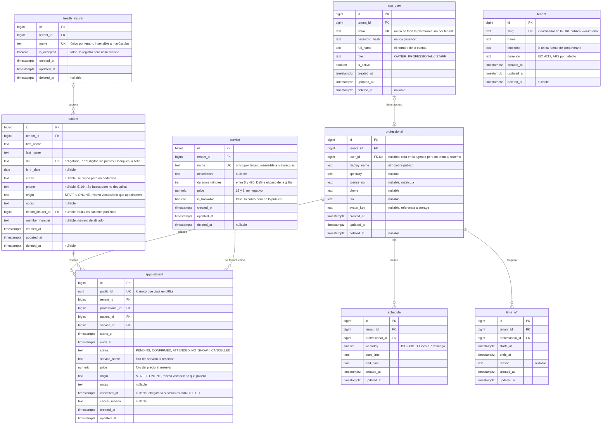

# Modelo de datos — MVP

Propuesta v2. Reemplaza el modelo de dominio inicial del pitch (pág. 13). Estado: **propuesta**, sin implementar.

PostgreSQL 16. Nueve tablas que cubren las cinco funcionalidades del MVP: autenticación con multi-tenancy, perfil profesional, pacientes, agenda y reserva pública. El DDL es la fuente de verdad; el diagrama es la misma información en otra forma.

## Tablas

| Tabla | Qué es | Baja |
| --- | --- | --- |
| `tenant` | el consultorio / la cuenta. Raíz de todo | `deleted_at` |
| `app_user` | quien inicia sesión | `deleted_at` |
| `professional` | quien atiende. Puede no tener cuenta | `deleted_at` |
| `health_insurer` | obras sociales y prepagas del consultorio | `deleted_at` |
| `patient` | quien es atendido | `deleted_at` |
| `service` | qué se ofrece, con precio y duración | `deleted_at` |
| `schedule` | regla semanal recurrente: cuándo se trabaja | se borra |
| `time_off` | feriado, vacaciones, bloqueo puntual: cuándo no | se borra |
| `appointment` | el turno. El centro del modelo | `status = 'CANCELLED'` |

## Relaciones

```text
tenant                    raíz — toda tabla lleva tenant_id → tenant
│
├── app_user        0..1 ──── 0..1  professional   (un profesional puede no entrar al sistema)
├── professional       1 ──── N     schedule       (cuándo se trabaja)
│                      1 ──── N     time_off       (cuándo no)
│                      1 ──── N     appointment    (atiende)
├── health_insurer  0..1 ──── N     patient        (NULL = paciente particular)
├── patient            1 ──── N     appointment    (reserva)
├── service            1 ──── N     appointment    (se factura como)
└── appointment                     el único lugar donde se cruzan las tres dimensiones:
                                    quién atiende, a quién, y qué servicio
```

Disponibilidad que ve el paciente = `schedule` − `time_off` − turnos ya tomados.

## Invariantes

Si una tabla nueva no las cumple, no entra.

- **R1.** Toda tabla lleva `tenant_id`, y toda clave foránea es compuesta: `FOREIGN KEY (tenant_id, patient_id) REFERENCES patient (tenant_id, id)`. Un turno del consultorio A no puede apuntar al paciente del B ni aunque el `WHERE` se olvide del tenant. Cuesta un `UNIQUE (tenant_id, id)` por tabla padre.
- **R2.** Un instante es un `timestamptz`, nunca fecha + hora. La zona vive una sola vez, en `tenant.timezone`. Excepción: `schedule.start_time` y `end_time` son `time`, porque son una regla semanal, no un instante.
- **R3.** El solapamiento de turnos lo impide la base (`EXCLUDE USING gist`), no el servicio: dos reservas simultáneas pasan las dos validaciones de Java antes de que cualquiera haga `commit`.
- **R4.** El turno guarda una foto del servicio: `service_name` y `price` se copian al reservar, así subir el precio no reescribe cuánto costó la consulta de marzo. La duración no se copia, porque es `ends_at − starts_at`; la moneda tampoco, porque es `tenant.currency`.
- **R5.** La baja es lógica donde hay historia, y los índices únicos son parciales (`WHERE deleted_at IS NULL`) para que dar de baja una ficha libere el identificador. El turno es la excepción: se mueve a `status = 'CANCELLED'`, que es la misma condición que libera el horario en la restricción anti-solapamiento.
- **R6.** Hacia afuera viaja `public_id uuid`; el `bigint` es interno. La página de reservas es pública: un id secuencial en la URL de confirmación deja enumerar los turnos de todos los consultorios sumando uno.
- **R7.** Los estados son conjuntos cerrados con `CHECK` (`status`, `role`, `origin`); el dinero es `numeric`, nunca `float`. Sin `NO_SHOW` explícito no se puede medir el ausentismo.

## Diagrama

Las precisiones (`numeric(12,2)`, los `CHECK` de formato) están en el DDL: Mermaid no admite comas en el tipo.



## Lo que la base hace cumplir sola

Cuatro restricciones que reemplazan validaciones de aplicación que tarde o temprano alguien olvida, duplica o pierde en una condición de carrera.

1. **Sin doble turno, ni con reservas simultáneas.** `appointment_no_overlap`, un `EXCLUDE USING gist` con `WHERE status <> 'CANCELLED'`: los turnos cancelados quedan fuera del índice, así el horario se libera al cancelar. Necesita la extensión `btree_gist`.
2. **El tenant viaja dentro de la clave foránea.** Cuesta un `UNIQUE (tenant_id, id)` por tabla padre, y el cruce entre consultorios pasa a ser imposible en escritura.
3. **Un paciente, una ficha.** `patient_dni_uk` es único por `(tenant_id, dni)`. La reserva pública no crea cuenta, así que el paciente que vuelve en marzo tiene que caer sobre su ficha de enero, y el DNI es el único identificador obligatorio que lo garantiza. La madre que reserva para sus dos hijos con su celular y su email genera dos fichas, porque los DNI son distintos.
4. **El `WHERE` olvidado no lo tapa la clave foránea.** Las FK compuestas impiden *referenciar* a otro consultorio, no *leerlo*: un `findAll()` sin filtro devuelve los pacientes de los tres nutricionistas piloto. Eso lo cubre el discriminador de Hibernate (`@TenantId` más `CurrentTenantIdentifierResolver`).

## DDL

```sql
CREATE EXTENSION IF NOT EXISTS btree_gist;

-- ───── raíz ────────────────────────────────────────────────────────────────
CREATE TABLE tenant (
  id          bigint GENERATED ALWAYS AS IDENTITY PRIMARY KEY,
  slug        text NOT NULL UNIQUE CHECK (slug ~ '^[a-z0-9-]{3,40}$'),  -- /r/nutri-ana
  name        text NOT NULL,
  timezone    text NOT NULL DEFAULT 'America/Argentina/Buenos_Aires',
  currency    text NOT NULL DEFAULT 'ARS' CHECK (length(currency) = 3),
  created_at  timestamptz NOT NULL DEFAULT now(),
  updated_at  timestamptz NOT NULL DEFAULT now(),
  deleted_at  timestamptz
);

-- ───── identidad ───────────────────────────────────────────────────────────
CREATE TABLE app_user (                      -- "user" es palabra reservada
  id            bigint GENERATED ALWAYS AS IDENTITY PRIMARY KEY,
  tenant_id     bigint NOT NULL REFERENCES tenant (id),
  email         text NOT NULL,
  password_hash text NOT NULL,               -- nunca "password"
  full_name     text NOT NULL,
  role          text NOT NULL CHECK (role IN ('OWNER','PROFESSIONAL','STAFF')),
  is_active     boolean NOT NULL DEFAULT true,
  created_at    timestamptz NOT NULL DEFAULT now(),
  updated_at    timestamptz NOT NULL DEFAULT now(),
  deleted_at    timestamptz,
  UNIQUE (tenant_id, id)                     -- destino de las FK compuestas
);
-- Global, no por tenant: el login es email + contraseña, sin preguntar el
-- consultorio. La consecuencia es que un email registrado en un consultorio
-- ya no se puede usar en otro. Se levanta junto con membership (ver más abajo).
CREATE UNIQUE INDEX app_user_email_uk ON app_user (lower(email))
  WHERE deleted_at IS NULL;
CREATE INDEX app_user_tenant_ix ON app_user (tenant_id);

CREATE TABLE professional (
  id          bigint GENERATED ALWAYS AS IDENTITY PRIMARY KEY,
  tenant_id   bigint NOT NULL REFERENCES tenant (id),
  user_id      bigint UNIQUE,                -- NULL: está en la agenda, no entra al sistema
  display_name text NOT NULL,                -- el nombre público ("Lic. Ana Pérez").
                                             -- app_user.full_name es el de la cuenta:
                                             -- son dos campos con dos propósitos.
  specialty    text,
  license_no   text,                         -- matrícula
  phone        text,
  bio          text,
  avatar_key   text,
  created_at  timestamptz NOT NULL DEFAULT now(),
  updated_at  timestamptz NOT NULL DEFAULT now(),
  deleted_at  timestamptz,
  UNIQUE (tenant_id, id),
  FOREIGN KEY (tenant_id, user_id) REFERENCES app_user (tenant_id, id)
);
CREATE INDEX professional_tenant_ix ON professional (tenant_id);

-- ───── personas y catálogo ─────────────────────────────────────────────────
CREATE TABLE health_insurer (                -- obras sociales y prepagas
  id          bigint GENERATED ALWAYS AS IDENTITY PRIMARY KEY,
  tenant_id   bigint NOT NULL REFERENCES tenant (id),
  name        text NOT NULL,
  is_accepted boolean NOT NULL DEFAULT true, -- false: la registro, pero no la atiendo
  created_at  timestamptz NOT NULL DEFAULT now(),
  updated_at  timestamptz NOT NULL DEFAULT now(),
  deleted_at  timestamptz,
  UNIQUE (tenant_id, id)
);
CREATE UNIQUE INDEX health_insurer_name_uk ON health_insurer (tenant_id, lower(name))
  WHERE deleted_at IS NULL;

CREATE TABLE patient (
  id          bigint GENERATED ALWAYS AS IDENTITY PRIMARY KEY,
  tenant_id   bigint NOT NULL REFERENCES tenant (id),
  first_name  text NOT NULL,
  last_name   text NOT NULL,
  dni         text NOT NULL CHECK (dni ~ '^[0-9]{7,9}$'),  -- sin puntos, se normaliza en la app
  birth_date  date,
  email       text,
  phone       text,                          -- normalizado E.164 en la app
  origin      text NOT NULL DEFAULT 'STAFF'   -- mismo vocabulario que
              CHECK (origin IN ('STAFF','ONLINE')),  -- appointment.origin
  notes       text,
  health_insurer_id bigint,                  -- NULL: paciente particular
  member_number     text,                    -- número de afiliado
  created_at  timestamptz NOT NULL DEFAULT now(),
  updated_at  timestamptz NOT NULL DEFAULT now(),
  deleted_at  timestamptz,
  UNIQUE (tenant_id, id),
  CHECK (email IS NOT NULL OR phone IS NOT NULL),  -- algún canal de contacto
  -- un número de afiliado sin obra social no significa nada
  CHECK (member_number IS NULL OR health_insurer_id IS NOT NULL),
  FOREIGN KEY (tenant_id, health_insurer_id) REFERENCES health_insurer (tenant_id, id)
);

-- El DNI es el identificador de una persona en este dominio y es obligatorio:
-- la reserva pública también lo pide. Por eso deduplica siempre, no sólo cuando
-- alguien se acordó de cargarlo. Sigue siendo parcial sobre deleted_at: una
-- ficha borrada no bloquea volver a dar de alta a la misma persona.
CREATE UNIQUE INDEX patient_dni_uk ON patient (tenant_id, dni)
  WHERE deleted_at IS NULL;
-- Ni el email ni el teléfono deduplican: una madre reserva para sus dos hijos
-- con su celular y su email, y son dos pacientes distintos. Deduplica el DNI.
-- Estos dos índices existen sólo para encontrar la ficha por lo que el paciente
-- dice cuando llama.
CREATE INDEX patient_email_ix ON patient (tenant_id, lower(email))
  WHERE email IS NOT NULL;
CREATE INDEX patient_phone_ix ON patient (tenant_id, phone)
  WHERE phone IS NOT NULL;

CREATE TABLE service (
  id               bigint GENERATED ALWAYS AS IDENTITY PRIMARY KEY,
  tenant_id        bigint NOT NULL REFERENCES tenant (id),
  name             text NOT NULL,
  description      text,
  duration_minutes int NOT NULL CHECK (duration_minutes BETWEEN 5 AND 480),
  price            numeric(12,2) NOT NULL CHECK (price >= 0),
  is_bookable      boolean NOT NULL DEFAULT true,  -- lo cobro, pero no lo publico
  created_at       timestamptz NOT NULL DEFAULT now(),
  updated_at       timestamptz NOT NULL DEFAULT now(),
  deleted_at       timestamptz,
  UNIQUE (tenant_id, id)
);
CREATE UNIQUE INDEX service_name_uk ON service (tenant_id, lower(name))
  WHERE deleted_at IS NULL;

-- ───── disponibilidad ──────────────────────────────────────────────────────
CREATE TABLE schedule (                      -- regla semanal recurrente
  id              bigint GENERATED ALWAYS AS IDENTITY PRIMARY KEY,
  tenant_id       bigint NOT NULL REFERENCES tenant (id),
  professional_id bigint NOT NULL,
  weekday         smallint NOT NULL CHECK (weekday BETWEEN 1 AND 7),  -- ISO-8601
  start_time      time NOT NULL,
  end_time        time NOT NULL,
  created_at      timestamptz NOT NULL DEFAULT now(),
  updated_at      timestamptz NOT NULL DEFAULT now(),
  CHECK (end_time > start_time),
  -- la grilla se recorre en pasos de service.duration_minutes, no de la franja
  UNIQUE (tenant_id, professional_id, weekday, start_time),
  FOREIGN KEY (tenant_id, professional_id) REFERENCES professional (tenant_id, id)
);
CREATE INDEX schedule_lookup_ix ON schedule (tenant_id, professional_id, weekday);

CREATE TABLE time_off (                      -- feriado, vacaciones, bloqueo puntual
  id              bigint GENERATED ALWAYS AS IDENTITY PRIMARY KEY,
  tenant_id       bigint NOT NULL REFERENCES tenant (id),
  professional_id bigint NOT NULL,           -- un cierre del consultorio con N
                                             -- profesionales son N filas; saca un
                                             -- OR de la consulta más caliente
  starts_at       timestamptz NOT NULL,
  ends_at         timestamptz NOT NULL,
  reason          text,
  created_at      timestamptz NOT NULL DEFAULT now(),
  updated_at      timestamptz NOT NULL DEFAULT now(),
  CHECK (ends_at > starts_at),
  FOREIGN KEY (tenant_id, professional_id) REFERENCES professional (tenant_id, id)
);
CREATE INDEX time_off_lookup_ix ON time_off (tenant_id, professional_id, starts_at);

-- ───── el turno ────────────────────────────────────────────────────────────
CREATE TABLE appointment (
  id               bigint GENERATED ALWAYS AS IDENTITY PRIMARY KEY,
  public_id        uuid NOT NULL DEFAULT gen_random_uuid() UNIQUE,  -- lo único en URLs
  tenant_id        bigint NOT NULL REFERENCES tenant (id),
  professional_id  bigint NOT NULL,
  patient_id       bigint NOT NULL,
  service_id       bigint NOT NULL,
  starts_at        timestamptz NOT NULL,
  ends_at          timestamptz NOT NULL,
  status           text NOT NULL DEFAULT 'PENDING'
                   CHECK (status IN ('PENDING','CONFIRMED','ATTENDED','NO_SHOW','CANCELLED')),
  service_name     text NOT NULL,            -- ┐ foto del servicio al reservar: cambiar
  price            numeric(12,2) NOT NULL,   -- ┘ el precio no reescribe la de marzo.
                                             --   La duración NO se copia: es ends_at
                                             --   − starts_at. La moneda tampoco: es
                                             --   tenant.currency.
  origin           text NOT NULL DEFAULT 'STAFF'   -- mismo vocabulario que
                   CHECK (origin IN ('STAFF','ONLINE')),  -- patient.origin
  notes            text,
  cancelled_at     timestamptz,
  cancel_reason    text,
  created_at       timestamptz NOT NULL DEFAULT now(),
  updated_at       timestamptz NOT NULL DEFAULT now(),
  CHECK (ends_at > starts_at),
  CHECK ((status = 'CANCELLED') = (cancelled_at IS NOT NULL)),
  -- sin UNIQUE (tenant_id, id): en el MVP nada referencia al turno. El índice
  -- entra con la migración de v1.1, que de todos modos va a existir.
  FOREIGN KEY (tenant_id, professional_id) REFERENCES professional (tenant_id, id),
  FOREIGN KEY (tenant_id, patient_id)      REFERENCES patient (tenant_id, id),
  FOREIGN KEY (tenant_id, service_id)      REFERENCES service (tenant_id, id),
  CONSTRAINT appointment_no_overlap EXCLUDE USING gist (
    professional_id WITH =,
    tstzrange(starts_at, ends_at, '[)') WITH &&
  ) WHERE (status <> 'CANCELLED')
);
CREATE INDEX appointment_agenda_ix  ON appointment (tenant_id, professional_id, starts_at);
CREATE INDEX appointment_patient_ix ON appointment (tenant_id, patient_id, starts_at DESC);
```

## Supuestos

Decisiones de producto que el esquema da por resueltas. Si alguna se resuelve al revés, la tabla que la sostiene cambia.

- **Grilla.** La disponibilidad se recorre en pasos de `service.duration_minutes`: el paciente elige servicio y después hora (pitch, pág. 6). Por eso `schedule` no tiene un `slot_minutes`, que sería una segunda fuente para la misma grilla.
- **Estado.** El turno online nace `PENDING`; el que carga el staff nace `CONFIRMED`. La transición es manual, desde la agenda, así que no depende de las notificaciones — que están fuera de alcance.
- **Tiempo.** `updated_at` la mantiene Hibernate (`@UpdateTimestamp`), no la base: `DEFAULT now()` sólo corre en el `INSERT`. Lo que escriba fuera de JPA tiene que setearla a mano o la columna miente.
- **Salud.** Toda la base contiene datos de salud; no hay un nivel administrativo. El cruce de `patient` + `appointment` + `service` ya revela un tratamiento. Cifrado en reposo y acceso auditado aplican a todas las tablas.
- **Tenant.** Dentro de la app el consultorio lo dice la sesión; en la reserva pública no hay sesión y sale del `slug` de la URL, o sea que en el endpoint más expuesto el consultorio es entrada del usuario. Esos endpoints tienen que estar acotados a lecturas concretas y a crear un turno, nunca a leer fichas. El valor se guarda por request en el hilo, y Tomcat reusa los hilos: si no se limpia al terminar — también cuando el request falla — el siguiente request hereda el consultorio del anterior y devuelve los pacientes equivocados, sin error. Sin consultorio en contexto, fallar fuerte.
- **Login.** El email es único en toda la plataforma, no por consultorio: un email registrado en un consultorio ya no se puede usar en otro. En `patient` el único es por tenant, porque un paciente sí puede existir en dos consultorios.
